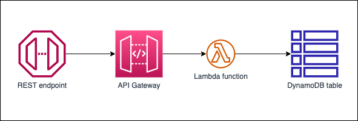

# Structure a Python project in hexagonal architecture using AWS Lambda

This repository contains a sample CRUD API in written in Python using AWS Lambda. The project is structured in hexagonal architecture. The API is exposed using Amazon API Gateway. Amazon DynamoDB is used as the data repository.

  - [Architecture](#architecture)
  - [API usage](#api-usage)
  - [Project structure](#project-structure)
  - [Local installation](#local-installation)
  - [Running unit tests](#running-unit-tests)
  - [Running code quality checks](#running-other-code-quality-checks)
  - [Deploying the application](#deploying-the-application)
  - [Deleting the application](#deleting-the-application)

## Architecture



The architecture is completely serverless. Clients can send requests to an Amazon API Gateway endpoint. The API Gateway forward to request to the target lambda function that implements the hexagonal architecture pattern. CRUD operations are performed on an Amazon DynamoDB table.

## API usage

Amazon API Gateway is configured to use [IAM authorization](https://docs.aws.amazon.com/apigateway/latest/developerguide/permissions.html). The API supports 5 operations which are CRUD operations on a `product` entity:

### Product entity

The `product` entity used in the repository contains the following attributes:

- id: str = Unique identifier
- name: str = Mandatory product name
- description: str = Optional product description
- createDate: str = Creation date of the product in ISO 8601 format
- lastUpdateDate: str = Last update date of the product in ISO 8601 format

### API operations

- `GET /products` : Returns all products. Expects `pageSize` and `nextToken` (Only for pages from 2) in query parameters.
- `POST /products` : Creates a new product. Expects `name` and `description` in body.
- `GET /products/{id}` : Returns a specific product.
- `PUT /products/{id}` : Updates a specific product. Expects `name` and/or `description` in body.
- `DELETE /products/{id}` : Deletes a specific product.

## Project structure
```
app/  # application code
|--- adapters/  # implementation of the ports defined in the domain
     |--- tests/  # adapter unit tests
|--- entrypoints/  # primary adapters, entry points
     |--- api/  # api entry point
          |--- model/  # api model
          |--- tests/  # end to end api tests
|--- domain/  # domain to implement business logic using hexagonal architecture
     |--- command_handlers/  # handlers used to execute commands on the domain
     |--- commands/  # commands on the domain
     |--- events/  # events triggered via the domain
     |--- exceptions/  # exceptions defined on the domain
     |--- model/  # domain model
     |--- ports/  # abstractions used for external communication
     |--- tests/  # domain tests
|--- libraries/  # 3rd party libraries used by the Lambda function
infra/  # infrastructure code
simple-crud-app.py  # AWS CDK v2 app
```

## Local installation

1. Install poetry:
```sh
pip install poetry
```
2. Install packages from the root directory. This command will install application and CDK packages. It will also install development packages required for running unit tests:
```
poetry install
```
3. You can see graphical representation of installed packages by running:
```sh
poetry show --tree
```
4. You can update all dependencies by running:
```sh
poetry update
```

## Running unit tests

Pytest is used as the unit testing framework. We recommend following setup in Visual Studio Code for configuring pytest:

`.vscode/settings` file:
```json
{
    "python.testing.pytestArgs": [
        "app/adapters/tests",
        "app/entrypoints/api/tests",
        "app/domain/tests",
        "--ignore=cdk.out",
    ],
    "python.testing.unittestEnabled": false,
    "python.testing.pytestEnabled": true,
    "python.envFile": "${workspaceFolder}/.env",
}
```

`.env` file. This is to ensure root directory of the project is included in the `PYTHONPATH`, so that `pytest` can find it:
```sh
PYTHONPATH=.
```

Then you can run unit tests using Visual Studio Code Testing GUI or using the command:

```sh
python -m pytest
```

## Running code quality checks
This project ships with multiple additional quality control tools:
- black - Code formatter.
- isort - Library to sort imports alphabetically, and automatically separated into sections and by type.
- flake8 - Linter validating compliance with the PEP8 standard.
- mypy - Static type checker. It aims to combine the benefits of dynamic (or "duck") typing and static typing.
- bandit - Tool designed to find common security issues in Python code.

All of this packages are specified pre-configured in `pyproject.toml` file. After following [Installation](#local-installation) section run following command from project root directory:
```sh
 pflake8 . && isort . && mypy . && bandit -rv .
```

## Deploying the application

### A note on security

This is a reference architecture to demonstrate hexagonal architecture in AWS Lambda. Please consider the following security topics to use it in a production environment: 
* Use AWS KMS Customer Managed Keys to encrypt [AWS CloudWatch log groups](https://docs.aws.amazon.com/AmazonCloudWatch/latest/logs/encrypt-log-data-kms.html) and [Amazon DynamoDB tables](https://docs.aws.amazon.com/kms/latest/developerguide/services-dynamodb.html).
* Configure [AWS WAF for the Amazon API Gateway](https://docs.aws.amazon.com/apigateway/latest/developerguide/apigateway-control-access-aws-waf.html) to allow access only from your organization's network.
* Consider other options for Amazon API Gateway authorization if IAM does not fit your needs: [Amazon Cognito user pool](https://docs.aws.amazon.com/apigateway/latest/developerguide/apigateway-integrate-with-cognito.html) or [API Gateway Lambda authorizer](https://docs.aws.amazon.com/apigateway/latest/developerguide/apigateway-use-lambda-authorizer.html).
* Use [Amazon DynamoDB backups](https://docs.aws.amazon.com/amazondynamodb/latest/developerguide/BackupRestore.html).
* Configure Amazon Lambdas with a [VPC deployment](https://docs.aws.amazon.com/lambda/latest/dg/configuration-vpc.html) to keep network traffic inside the cloud. 

### Deploy steps

CDK is configured to package each project as a Lambda or a Layer using the folder structure from the repository. This way, unit tests can reference modules directly without loading them dynamically, and the deployed application maintains the same folder structure in the AWS Lambda. 

Follow these steps to deploy the application to an AWS account ([Detailed information](https://docs.aws.amazon.com/cdk/v2/guide/getting_started.html)):

1. Install AWS CDK v2:
```sh
npm install -g aws-cdk
```
2. Bootstrap CDK into your account and region:
```sh
cdk bootstrap aws://12345678900/us-east-1
```
3. Deploy the application as a CloudFormation stack using an AWS profile:
```sh
cdk deploy --profile aws-profile-name
```

## Deleting the application

1. Deployed CloudFormation stack can be deleted using the following command:
```sh
cdk destroy --profile aws-profile-name
```
2. You need to delete the DynamoDB table manually from the AWS console as CDK is configured with `RETAIN` removal policy.

